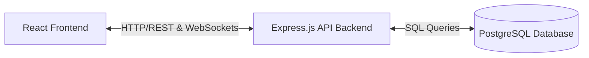

# BUILD_PLAN.md

This document outlines the research, system architecture, collaboration log, and implementation steps scheduled for the Splitwise Clone application.

---

## 1. Product Research

### Studying Splitwise Core Behavior
Through studying Splitwise, we mapped the fundamental loop of shared expenses:
1. **User Identity:** Users sign up and form direct friendships or structured groups.
2. **The Group Loop:** Group membership builds a boundary where collective expenses can be logged. 
3. **The Expense Transaction:** Adding an expense requires specifying who paid, what amount was paid, and how it is divided among a set of participants.
4. **The Balance sheet:** Splitwise updates running ledger entries dynamically:
   - Positive balance: User is owed money.
   - Negative balance: User owes money.
5. **Debt Settlement:** Creating a settlement records a transfer of funds to reduce the debt to zero.

### Product Assumptions Made
* **Default Currency:** All calculations assume a single default currency (USD) stored as integer cents to avoid conversion complexities.
* **Simplification Bypass:** Users in groups will see direct bilateral debts rather than graph-simplified flows.
* **Instant Verification:** Message boards inside expenses update instantly via WebSockets without manual page refresh.

---

## 2. System Architecture

The application is structured into a classic client-server model, utilizing a relational database to enforce transaction integrity.

### Technical Stack Summary
* **Backend:** Node.js, Express, Socket.IO, JWT.
* **Database:** PostgreSQL.
* **Frontend:** React, Vite, React Router, Tailwind CSS, Axios.
* **Hosting/Deployment:** Vercel (Frontend) and Render (Backend & DB).

### Key Architectural Files Map
* **Backend Skeleton:** `/backend/server.js`, `/backend/config/db.js`, `/backend/routes/`, `/backend/controllers/`, `/backend/models/`.
* **Frontend Skeleton:** `/frontend/src/App.jsx`, `/frontend/src/components/`, `/frontend/src/pages/`, `/frontend/src/context/`.

---

## 3. AI Collaboration Process

### Interaction History
* **Phase 1: Workflow Setup:** The AI (acting as a junior engineer) proposed a step-by-step development process, which the user approved and committed to the repository in `implementation.txt`.
* **Phase 2: Product & Scope Alignment:** The AI interviewed the user on product scope, user personas, authentication, groups, expenses, and chat protocols. The user outlined the requirements (JWT HTTP-only cookies, Socket.IO, bilateral splits).
* **Phase 3: Architecture & Data Model:** The AI interviewed the user regarding relational choices and balance handling. The user confirmed PostgreSQL, React + Vite, Tailwind CSS, cents-based integer storage, and remainder-to-first-user rounding.

### AI_CONTEXT.md Maintenance
* `AI_CONTEXT.md` was created as the single source of truth. As we write modules, this context file will be updated with any adjustments to schemas, APIs, or logic constraints.

---

## 4. Engineering Trade-offs & Limitations

### Simplifications
* **Direct Splits Only:** The engine computes user balances directly, avoiding complex network flow algorithms (such as the Ford-Fulkerson or simplify-debts algorithms).
* **Cents-based Storage:** Storing `$10.00` as `1000` integers simplifies backend split logic and guarantees database consistency, though it requires frontend formatting components.
* **Manual Invite Resolution:** Members are added via direct registered email invitations, avoiding the complexity of unique join-link tokens.

### Hardcoded elements
* Currency formatting is hardcoded to USD symbols ($).
* Categories are limited to a predefined set: Food, Travel, Rent, Utilities, Entertainment, and Other.
